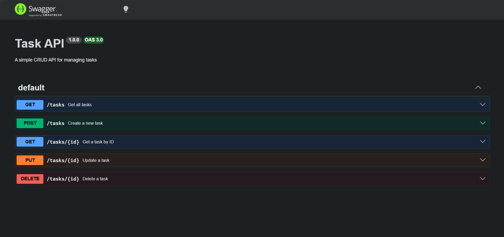

# Task API

A beginner-friendly CRUD REST API for managing a to-do task list, built with Node.js and Express. 
Data is stored in-memory — no database required. Built as part of the FlyRank Backend AI Engineering Internship Program.

---

## How to Run

Make sure you have Node.js installed, then:

```bash
npm install
node index.js
```

Server starts at: http://localhost:3000  
Swagger UI docs at: http://localhost:3000/docs

---

## Endpoints

| Method | Endpoint | Description | Status Codes |
|--------|----------|-------------|--------------|
| GET | / | Server info & intern details | 200 |
| GET | /health | Health check | 200 |
| GET | /tasks | Get all tasks | 200 |
| GET | /tasks/:id | Get a single task by ID | 200, 404 |
| POST | /tasks | Create a new task | 201, 400 |
| PUT | /tasks/:id | Update a task's title or status | 200, 400, 404 |
| DELETE | /tasks/:id | Delete a task | 204, 404 |

---

## Request & Response Examples

### Get all tasks
```bash
curl -i http://localhost:3000/tasks
```
Response:
```json
[
  { "id": 1, "title": "do assignment 1", "done": false },
  { "id": 2, "title": "Read a resource", "done": true },
  { "id": 3, "title": "take a shower", "done": false }
]
```

### Get a single task
```bash
curl -i http://localhost:3000/tasks/1
```
Response:
```json
{ "id": 1, "title": "do assignment 1", "done": false }
```

### Create a task
```bash
curl -i -X POST http://localhost:3000/tasks -H "Content-Type: application/json" -d '{"title":"Buy milk"}'
```
Response `201`:
```json
{ "id": 4, "title": "Buy milk", "done": false }
```

### Update a task
```bash
curl -i -X PUT http://localhost:3000/tasks/1 -H "Content-Type: application/json" -d '{"done":true}'
```
Response `200`:
```json
{ "id": 1, "title": "do assignment 1", "done": true }
```

### Delete a task
```bash
curl -i -X DELETE http://localhost:3000/tasks/1
```
Response: `204 No Content`

### Error — task not found
```bash
curl -i http://localhost:3000/tasks/99
```
Response `404`:
```json
{ "error": "Task 99 not found" }
```

---

## Status Codes Used

| Code | Meaning | When |
|------|---------|------|
| 200 | OK | Successful GET or PUT |
| 201 | Created | Successful POST |
| 204 | No Content | Successful DELETE |
| 400 | Bad Request | Missing or invalid input |
| 404 | Not Found | Task ID doesn't exist |

---

## Tech Stack

- **Runtime:** Node.js
- **Framework:** Express
- **API Docs:** Swagger UI (swagger-ui-express)
- **Storage:** In-memory (array) — data resets on server restart

---

## Swagger UI

Interactive API documentation available at http://localhost:3000/docs



---

## The Mortality Experiment

When the server restarts, all tasks created during the previous session are permanently lost. 
This happens because data is stored in-memory (a JavaScript array), not in a database — 
the array resets to its original 3 tasks every time the server starts fresh. 

---

## About

Built by Murtaza Mustafa — Back-End AI Engineering Intern at FlyRank  
Program: Backend AI Engineering — July 2026