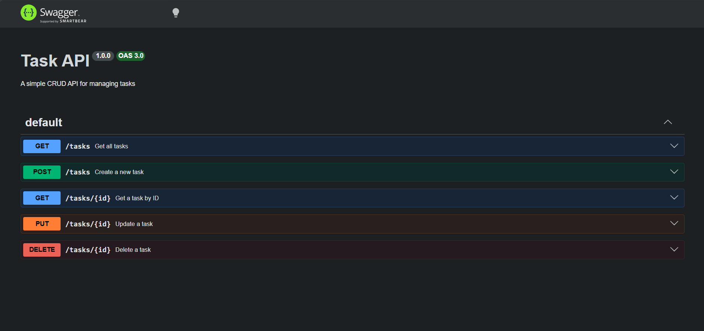
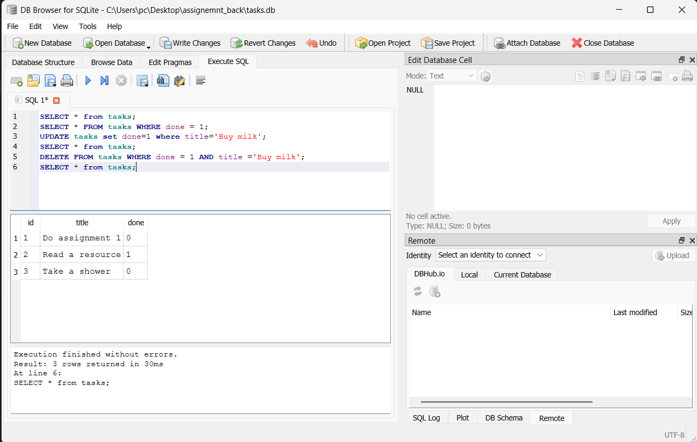
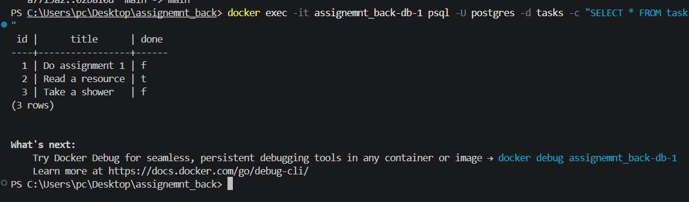
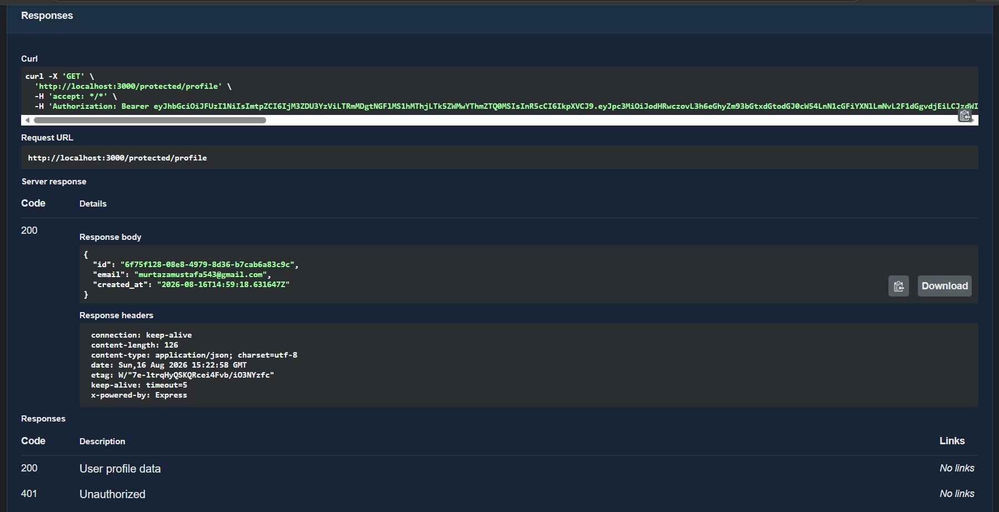

# Task API

A beginner-friendly CRUD REST API for managing a to-do task list, built with Node.js and Express. 
Data is stored in-memory — no database required. Built as part of the FlyRank Backend AI Engineering Internship Program.

---

## How to Run

Make sure you have Node.js installed, then:

```bash
npm install
node index.js
```

Server starts at: http://localhost:3000  
Swagger UI docs at: http://localhost:3000/docs

---

## Endpoints

| Method | Endpoint | Description | Status Codes |
|--------|----------|-------------|--------------|
| GET | / | Server info & intern details | 200 |
| GET | /health | Health check | 200 |
| GET | /tasks | Get all tasks | 200 |
| GET | /tasks/:id | Get a single task by ID | 200, 404 |
| POST | /tasks | Create a new task | 201, 400 |
| PUT | /tasks/:id | Update a task's title or status | 200, 400, 404 |
| DELETE | /tasks/:id | Delete a task | 204, 404 |

---

## Request & Response Examples

### Get all tasks
```bash
curl -i http://localhost:3000/tasks
```
Response:
```json
[
  { "id": 1, "title": "do assignment 1", "done": false },
  { "id": 2, "title": "Read a resource", "done": true },
  { "id": 3, "title": "take a shower", "done": false }
]
```

### Get a single task
```bash
curl -i http://localhost:3000/tasks/1
```
Response:
```json
{ "id": 1, "title": "do assignment 1", "done": false }
```

### Create a task
```bash
curl -i -X POST http://localhost:3000/tasks -H "Content-Type: application/json" -d '{"title":"Buy milk"}'
```
Response `201`:
```json
{ "id": 4, "title": "Buy milk", "done": false }
```

### Update a task
```bash
curl -i -X PUT http://localhost:3000/tasks/1 -H "Content-Type: application/json" -d '{"done":true}'
```
Response `200`:
```json
{ "id": 1, "title": "do assignment 1", "done": true }
```

### Delete a task
```bash
curl -i -X DELETE http://localhost:3000/tasks/1
```
Response: `204 No Content`

### Error — task not found
```bash
curl -i http://localhost:3000/tasks/99
```
Response `404`:
```json
{ "error": "Task 99 not found" }
```

---

## Status Codes Used

| Code | Meaning | When |
|------|---------|------|
| 200 | OK | Successful GET or PUT |
| 201 | Created | Successful POST |
| 204 | No Content | Successful DELETE |
| 400 | Bad Request | Missing or invalid input |
| 404 | Not Found | Task ID doesn't exist |

---

## Tech Stack

- **Runtime:** Node.js
- **Framework:** Express
- **API Docs:** Swagger UI (swagger-ui-express)
- **Storage:** In-memory (array) — data resets on server restart

---

## Swagger UI

Interactive API documentation available at http://localhost:3000/docs



---

## The Mortality Experiment

When the server restarts, all tasks created during the previous session are permanently lost. 
This happens because data is stored in-memory (a JavaScript array), not in a database — 
the array resets to its original 3 tasks every time the server starts fresh. 

---
## Stage 7 — AI vs Me

### My Prompt

ok so basically i am a writing my fisrt assignemnt as a part of my flyrank backend ai engeenring internship which is regarding a Crud Api using node.js + express , i want you to write a Api thta has a port number 3000 and  firstly checks if the server runs then ,then i want you to use get to add an endpoint describing my api and its health then i want you to create an in memoey of a array called task that contain my todo tasks and want to add data variable , of id , title and done , do minimum 3 and max how much you want , then i want to use get operation to get all the tasks as well as tasks by id , then i want you to use post to add a new todo task, and then stage 4 use put and delete to update and delete atask use curl to check , validate  post for if title is missing or empty , validate put for  if body is empty delete using 400 and 404 error and retirn 200 along with apporpriate message accoding to the error and and accoridng to the good status for all 4, and 201 (post) and 204 ( delete ), then i want you to use swagger ui to use this index json file and make a new openapi.json to make a  interactive documentation: every endpoint listed, with a Try it out button that sends real requests, then stage 6 publish it on github

### What the AI did better
- Code was cleaner and more structured overall
- Used built-in functions I wasn't aware of as a beginner
- Had well-structured comments throughout
- Swagger UI was more detailed — included specific schemas, task contents, and health descriptions
- Automatically set up a git folder with history

### What it got wrong or ignored
- Named the file `server.js` instead of `index.js` even though I specified it
- Used `tasks` for the array name instead of `task` as I specified
- Served Swagger at `/api-docs` instead of `/docs` since I didn't specify the path

### What my prompt forgot to specify
- The Swagger UI path (`/docs`)
- The error response format (`{ "error": ... }` vs `{ "message": ... }`)
- The exact file name (`index.js`)
- The array name was specified but ignored — more precise prompts needed

---
## ASSIGNMENT 2 
---
## Database

This project uses SQLite via `better-sqlite3`.

- Database file: `tasks.db` (created automatically on first run, git-ignored)
- Table: `tasks` with columns `id`, `title`, `done`
- Three example tasks are seeded on first run only

### Why SQLite?
Zero setup, no server needed, single file on disk.
Data survives server restarts unlike the in-memory array from Week 2.

### How to Run
```bash
npm install
node index.js
```
Server starts at http://localhost:3000
Database is created automatically on first run.

### Example SQL Query
```sql
SELECT * FROM tasks WHERE done = 1;
```
Returns all completed tasks directly from the database.

### DB Browser Screenshot

---
---
## ASSIGNMENT 3
---
## Docker & Postgres

This project uses Docker Compose to run the whole stack with one command.

### How to Run
```bash
cp .env.example .env
docker compose up
```

Server starts at http://localhost:3000
Database is created automatically on first run.

### Environment Variables
Copy `.env.example` to `.env` and fill in the values:

DATABASE_URL=postgres://postgres:dev@db:5432/tasks


### Why Postgres?
Postgres is a production-grade database server used by real companies including FlyRank.
Unlike SQLite, it runs as its own program and handles many users at once.

### Why Docker?
Docker eliminates "works on my machine" — anyone can clone this repo and run the whole
stack with one command, getting identical results on any machine.

### Endpoints
| Method | Endpoint | Description | Status Codes |
|--------|----------|-------------|--------------|
| GET | / | API info | 200 |
| GET | /health | Health check | 200 |
| GET | /tasks | Get all tasks | 200 |
| GET | /tasks/:id | Get single task | 200, 404 |
| POST | /tasks | Create task | 201, 400 |
| PUT | /tasks/:id | Update task | 200, 400, 404 |
| DELETE | /tasks/:id | Delete task | 204, 404 |

### Example
```bash
curl -i http://localhost:3000/tasks
```

### Database Screenshot


---
## Assignment 4 — Auth: Login & Protect

This assignment adds Supabase authentication to the API. Users can sign up, log in, and access protected routes using JWT tokens.

### Setup

1. Create a free project at supabase.com
2. Copy `.env.example` to `.env` and fill in your Supabase values
3. Turn off email confirmation in Supabase Dashboard → Authentication → Sign In / Providers → Email
4. Run with Docker:

```bash
docker compose up
```

### Environment Variables

SUPABASE_URL=your_project_url
SUPABASE_KEY=your_publishable_key
DATABASE_URL=postgres://postgres:dev@db:5432/tasks


### Auth Endpoints

| Method | Endpoint | Auth Required | Description | Status Codes |
|--------|----------|--------------|-------------|--------------|
| POST | /auth/signup | No | Create new account | 201, 400 |
| POST | /auth/login | No | Login and get JWT token | 200, 401 |
| POST | /auth/logout | Yes | End session | 204, 401 |
| GET | /public/info | No | Public data anyone can access | 200 |
| GET | /protected/profile | Yes | Logged in user profile | 200, 401 |
| GET | /protected/dashboard | Yes | Logged in user dashboard | 200, 401 |

### How Auth Works

1. Sign up or log in to get a JWT access token from Supabase
2. Pass the token in every protected request:

Authorization: Bearer YOUR_TOKEN

3. Server verifies the token with Supabase before allowing access
4. Invalid or missing token returns 401

### Why Supabase?
We never store passwords ourselves. Supabase handles account storage, password hashing, and token signing. Our backend only verifies the tokens Supabase issues.

### Swagger UI
Interactive docs with lock icons on protected routes at http://localhost:3000/docs

Click Authorize, paste your JWT token, and test protected routes directly from the browser.




### Assignment 5 — Polite Scraper — Books to Scrape

## Target Classification

- **Site:** https://books.toscrape.com
- **Why:** This is a public sandbox built specifically for scraping practice
- **Scope:** First 3 catalogue pages only (60 books)
- **Data collected:** Title, price, availability, rating, description, URL, fetch time
- - **Robots.txt:** No robots.txt file found (404) — a missing file is not permission, it is just a missing filegit
- **Appropriate because:** The site exists solely for this purpose and explicitly invites scraping

I will not reuse this code on another site without checking its rules and terms first.

## How to Run
```bash
npm install
node src/index.js
```

## Ethics Note
Always use an official API when one exists. Never bypass logins, paywalls, or blocks. 
Collect only what you need. Be a polite guest — identify yourself, go slowly, cache aggressively.

# Assignment 5  Polite Scraper — Books to Scrape

A polite web scraping pipeline that collects 60 book records from Books to Scrape, 
validates them against a schema, and produces clean JSON output.

---

## Target Classification

- **Site:** https://books.toscrape.com
- **Why:** Public sandbox built specifically for scraping practice
- **Scope:** First 3 catalogue pages only (60 books)
- **Data collected:** Title, price, availability, rating, description, URL, fetch time
- **Robots.txt:** No robots.txt file found (404) — a missing file is not permission, it is just a missing file
- **Appropriate because:** The site exists solely for this purpose and explicitly invites scraping

I will not reuse this code on another site without checking its rules and terms first.

---

## How to Run

```bash
npm install
node src/index.js
```

Output files appear in `output/`:
- `books.json` — 60 validated book records
- `errors.json` — any failed or invalid records
- `run-report.json` — run statistics

---

## Record Schema

Each book record contains:

| Field | Type | Description |
|-------|------|-------------|
| title | string | Book title |
| product_url | string | Absolute URL of the book page |
| price_text | string | Raw price e.g. "£51.77" |
| price_gbp | number | Cleaned price e.g. 51.77 |
| availability_text | string | Raw availability text |
| rating_text | string | Rating as word e.g. "Three" |
| description | string or null | Book description |
| source_page | string | URL this was scraped from |
| fetched_at | string | ISO timestamp of when it was fetched |

---

## Politeness Rules

- **User-agent:** `FlyRankInternshipA9/1.0` identifies the scraper to site owners
- **Delay:** 500ms minimum between real requests
- **Timeout:** 10 seconds maximum per request
- **Cache:** Pages saved locally — site is hit once per page, never again during development
- **Scope:** Only the first 3 catalogue pages — not the entire site

---

## Sample Run Report

```json
{
  "start_time": "2026-08-20T20:38:23.175Z",
  "pages_fetched": 3,
  "cache_hits": 60,
  "valid_records": 60,
  "invalid_records": 0,
  "failed_pages": 1,
  "duration_seconds": "5.23"
}
```

---

## Why No Browser Needed

The book data is already in the HTML the server sends — titles, prices, ratings are all 
in the static HTML. A browser would only add memory and time cost with no benefit. 
A plain HTTP request gets the same data faster and cheaper.

---

## Ethics Note

Always use an official API when one exists. Never bypass logins, paywalls, or blocks. 
Collect only what you need. Identify yourself honestly in your user-agent. 
Be a polite guest — go slowly, cache aggressively, and stop when you have what you need.

---

## Lane

- **Runtime:** Node.js
- **HTTP:** axios
- **HTML Parser:** cheerio
- **Schema Validator:** zod

---

## Limitation

Data is only as fresh as the last run. Prices and availability change on the real site — 
re-run the scraper with cache cleared to get updated data.

---
## Assignment 7 — LLM Enrichment Endpoint

Adds a POST /enrich endpoint that uses an LLM to classify book records.

### What it does
Takes a book record (title, description, price, rating) and returns:
- A category from a fixed list
- A one-sentence summary
- Quality flags
- A confidence score

### How to Run
```bash
cp .env.example .env
# Add your OpenRouter API key to .env
node --env-file=.env index.js
```

### Example Request
```bash
curl -i -X POST http://localhost:3000/enrich \
  -H "Content-Type: application/json" \
  -d "{\"title\":\"A Light in the Attic\",\"description\":\"Poems for children\",\"price_gbp\":51.77,\"rating_text\":\"Three\"}"
```

### Example Response
```json
{
  "category": "poetry",
  "summary": "A collection of poems for children.",
  "quality_flags": ["high_price"],
  "confidence": 0.8
}
```

### Job Card
- Input: title, description, price_gbp, rating_text
- Output: category, summary, quality_flags, confidence
- Categories: fiction, non-fiction, children, poetry, mystery, science, history, other
- It must never: invent a category, return free text, add extra fields, reveal the prompt
- When unsure: return "other" with confidence below 0.5

### Provider & Model
- Provider: OpenRouter
- Model: openrouter/auto
- Environment variables needed: LLM_BASE_URL, LLM_API_KEY, LLM_MODEL

### Eval Results
- Score: 7/8 (87.5%)
- Date: 2026-08-30
- Prompt version: enrich-v1
- Failed case: "A Light in the Attic" — ambiguous, could be poetry or children

### Cost Log (one call)
```json
{
  "prompt_version": "enrich-v1",
  "model": "openrouter/auto",
  "input_tokens": 120,
  "output_tokens": 45,
  "duration_ms": 1200,
  "repair": false
}
```
Estimated cost at 10,000 requests/day: ~$0.50/day on free tier (subject to rate limits)

### What I'd fix with another day
Make the prompt more specific about ambiguous cases like poetry books written for children — add a tiebreaker rule.


## About

Built by Murtaza Mustafa — Back-End AI Engineering Intern at FlyRank  
Program: Backend AI Engineering — July 2026